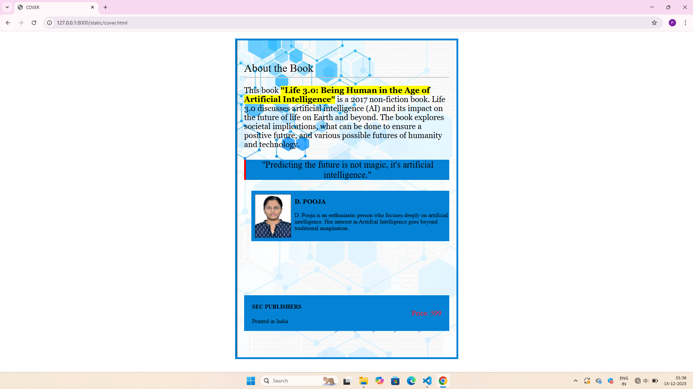

# Ex.05 Book Cover Page Design
## Date: 15.12.2025

## AIM:
To design a book back cover page using HTML and CSS.

## DESIGN STEPS:

### Step 1:
Create a Django Admin project.

### Step 2:
Create an app in the Django interface.

### Step 3:
Create a folder named 'static' in the app folder.

### Step 4:
Create a new HTML file in the static folder.

### Step 5:
Write the HTML code with relevant CSS properties.

### Step 6:
Choose the appropriate style and color scheme.

### Step 7:
Insert the images in their appropriate places.

### Step 8:
Publish the website in the LocalHost.

## PROGRAM:
```
<html>
<head>
    <title>COVER</title>
    <link href="style.css" rel="stylesheet">
</head>
<body>
    <div class="cover">
        <div class="top">About the Book</div>
        <div class="line">
        <hr class="top-hr">
        </div>

        <div class="content">
            <p>
                This book <b>"Life 3.0: Being Human in the Age of Artificial Intelligence"</b>
                is a 2017 non-fiction book. Life 3.0 discusses artificial intelligence (AI) 
                and its impact on the future of life on Earth and beyond. The book explores 
                societal implications, what can be done to ensure a positive future, and 
                various possible futures of humanity and technology.
            </p>
        </div>

        <div class="quote">
            "Predicting the future is not magic, it's artificial intelligence."
        </div>

        <div class="author">
            <div class="photo">
            
            </div>

            <div class="authorr">
            <h3>D. POOJA</h3>
            <p>
                D. Pooja is an enthusiastic person who focuses deeply on artificial 
                intelligence. Her interest in Aritifcal Intelligence goes beyond traditional imagination.
            </p>
        </div>
        </div>
        <div class="ending">
            <div class="under">
            <h4>SEC PUBLISHERS</h4>
            <p>Printed in India</p>
            </div>

            <div class="price">Price: 599</div>
         </div>
</body>
</html>

style.css
           
body {
    margin: 0;
    padding: 0;
    font-family: italic;
    color: black (25, 200, 209);
}

.cover {
    width: 618px;
    height: 889px;
    margin: 20px auto;
    background-image: url('Screenshot\ 2025-12-11\ 204303.png');
    background-size: cover;
    background-position: center;
    box-sizing: border-box;
    padding: 20px;
    border: 5px solid rgb(4, 130, 213)
}

.border {
    width: 100%;
    height: 100%;
    border: 5px solid rgb(227, 13, 120);
    box-sizing: border-box;
    display: flex;
    flex-direction: column;
    justify-content: space-between;
}

.top {
    text-align: left;
    font-size: 30px;
    margin-top: 40px;
}

.content {
    font-size: 18px;
    font-weight: light;
    color: light black;
    margin-top: 10px;
    font-size: 22px;
    font-family:Georgia;
}

b{
    background-color: yellow;
    font-weight: bold;
    
}

.quote {
    text-align: center;
    font-family: italic;
    background-color: rgb(4, 130, 213);
    border-left: 5px solid red;
    font-size: 25px;
    margin-top: 30px;
    margin-bottom: 30px;
 }

.author img{
    height: 120px;
    width: 100px;
    display: flex;
    padding: 10px;
}

.author{
    display: flex;
    background-color: rgb(4, 130, 213);
}

.author{
    margin-left: 20px;
}

.ending{
    background-color: white;
    margin-top: 150px;
    display: flex;
    justify-content: space-between;
    align-items: center;
    padding: 2px;
    background-color: rgb(4, 130, 213);
}

.ending h4{
    color: black;
}

.under{
    margin-left: 20px;
}

.price{
    color: red;
    font-size: 20px;
    margin-right: 20px;
}
```
## OUTPUT:



## RESULT:
The program for designing book back cover page using HTML and CSS is completed successfully.
